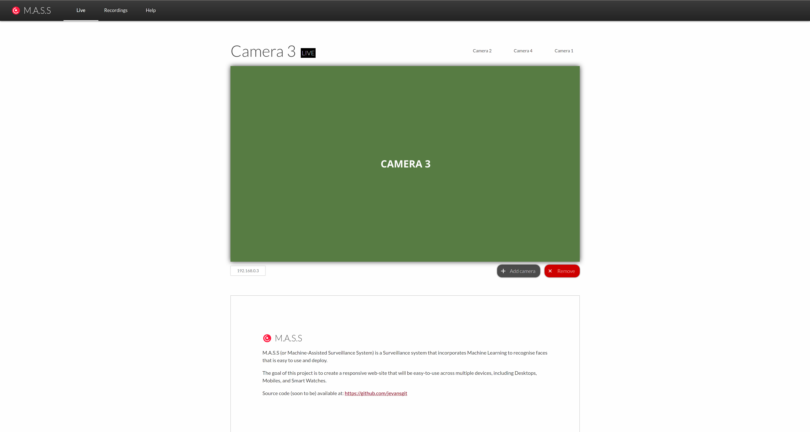

# Machine-Assisted Surveillance System Static (Old)
Note: Going forward, I will be redesigning these pages - also creating a new project repository. If you are interested, I will probably write a blog post about it <a href="https://jononthenet.com">on my website</a>


*This is part of the development files for creating a responsive surveillance system web application for my university project which involves implementing a surveillance system using responsive web design.*


This repository contains the static files for the Machine-Assisted Surveillaice System (MASS) Website.



## Getting things running
This project relies on packages provided through the NPM (Node JS Package Manager). Instructions for installation of NPM can be found [here](https://nodejs.org/en/download/).

In order to get started, the following node modules must be installed:
* gulp@3.9.1
* gulp-sass@4.0.2
* node-normalize-scss@8.0.0

These can be installed using by executing the command ```npm install -g``` from the root directory. (Will install globally)
 **It is reccomended to install a tool such as NVM (Node Version Manager) so that sudo access is not required.**

Running ```gulp``` from the command line will start the gulp build system. This will utilise the SASS program which is useful for compiling SASS (or SCSS) files to CSS files. This is useful as it provides [additional features that standalone CSS does not provide](https://sass-lang.com/guide).
